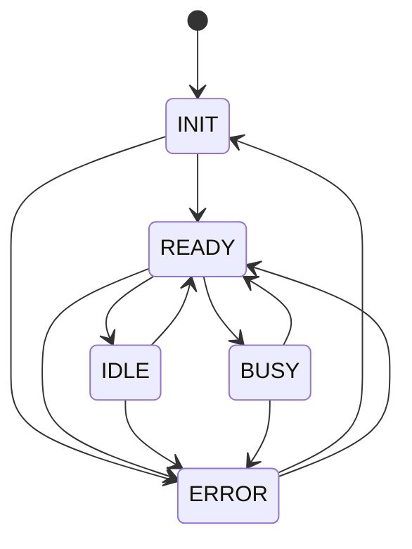

# Understanding Sessions

Sessions are the fundamental unit of work in Raworc. They provide isolated, manageable environments for agent execution with built-in state persistence.

## What is a Session?

A session in Raworc represents:
- A containerized work environment
- A specific set of assigned agents
- A persistent state that can be saved and restored
- A defined state machine with automatic resource management

## Session State Machine

### 1. Creation
```
User Request → Validation → Resource Allocation → Container Spawn → Agent Init
```

When a session is created:
- User provides initial prompt/context
- System validates permissions and resources
- Kubernetes allocates a container
- Agents are initialized within the container
- Persistent volume is attached for state

### 2. Execution
```
Work Request → Agent Processing → State Updates → Result Delivery
```

During execution:
- Agents process incoming work
- Guardrails ensure safety
- State continuously saved to persistent volume
- Results streamed back to user

### 3. Termination
```
TTL Expiry/Manual Stop → State Finalization → Container Cleanup → PV Retention
```

When a session ends:
- Final state saved to persistent volume
- Container resources released
- Persistent volume retained for future use
- Metadata updated in database

## Key Concepts

### Container Isolation

Each session runs in its own container providing:
- **Process Isolation**: No interference between sessions
- **Resource Limits**: CPU/memory boundaries
- **Network Isolation**: Secure communication
- **File System Isolation**: Private workspace

### Persistent Volumes

State preservation through Kubernetes PVs:
- **Automatic Saving**: Continuous state snapshots
- **Durability**: Survives container restarts
- **Portability**: Can be attached to new sessions
- **Versioning**: Track state evolution

### Agent Assignment

Flexible agent deployment per session:
- **Multiple Agents**: Assign any combination
- **Dynamic Loading**: Agents loaded on-demand
- **Configuration**: Per-session agent settings
- **Routing**: Work distribution between agents

## Session Management

### Creating Sessions

```bash
# Via REST API
POST /api/v0/sessions
{
  "name": "analysis-session",
  "starting_prompt": "Analyze Q4 sales data",
  "agent_ids": ["uuid-of-data-analyzer", "uuid-of-report-writer"],
  "waiting_timeout_seconds": 300,
  "metadata": {
    "project": "Q4-analysis",
    "priority": "high"
  }
}
```

Response:
```json
{
  "id": "session-uuid",
  "name": "analysis-session",
  "starting_prompt": "Analyze Q4 sales data",
  "state": "INIT",
  "waiting_timeout_seconds": 300,
  "created_by": "username",
  "agents": [
    {
      "id": "agent-uuid",
      "name": "data-analyzer",
      "model": "gpt-4"
    }
  ],
  "created_at": "2025-01-20T10:00:00Z"
}
```

### Session States

Sessions progress through a defined state machine with the following states:

1. **INIT**: Initial state
2. **READY**: Checking for messages over API
3. **IDLE**: Not picking up messages (waiting/timeout)
4. **BUSY**: Processing messages
5. **ERROR**: Error state

#### Valid State Transitions



- **INIT** can transition to **READY** or **ERROR**
- **READY** can transition to **IDLE**, **BUSY**, or **ERROR**
- **IDLE** can transition to **READY** or **ERROR**
- **BUSY** can transition to **READY** or **ERROR**
- **ERROR** can transition to **INIT** or **READY**

### Session Features

#### Soft Delete
Sessions are never hard deleted from the database. Instead, they are marked with a `deleted_at` timestamp, allowing for:
- Audit trail preservation
- Recovery if needed
- Historical analysis

#### Session Updates
You can update certain session properties while it's running:
```bash
PUT /api/v0/sessions/{id}
{
  "name": "Updated session name",
  "waiting_timeout_seconds": 600,
  "metadata": {
    "updated": true,
    "tags": ["important", "production"]
  }
}
```

#### Session Remixing

Sessions can be "remixed" to create new sessions that inherit configuration from a parent session:

```bash
# Create new session from previous
POST /api/v0/sessions/{parent-id}/remix
{
  "name": "analysis-continued",
  "starting_prompt": "Continue the analysis with visualizations",
  "agent_ids": ["uuid-of-visualization-agent"],
  "waiting_timeout_seconds": 600,
  "metadata": {
    "phase": "visualization"
  }
}
```

Benefits:
- **No Rework**: Continue exactly where you left off
- **Evolution**: Add new agents or capabilities
- **Experimentation**: Try different approaches
- **Collaboration**: Share session states

## Best Practices

### Session Naming
- Use descriptive names
- Include purpose or project
- Consider timestamp for uniqueness
- Example: `customer-analysis-2025-01-15`

### Resource Allocation
- Start with minimal resources
- Monitor usage and adjust
- Consider workload requirements
- Balance cost vs performance

### State Management
- Regular checkpoint saves
- Document session purpose
- Clean up unnecessary data
- Archive completed sessions

### Security
- Limit agent permissions
- Review assigned guardrails
- Audit session access
- Rotate credentials regularly

## Advanced Features

### Session Templates

Pre-configured session definitions:
```yaml
# session-template.yaml
apiVersion: v1
kind: SessionTemplate
metadata:
  name: data-analysis-template
spec:
  agents:
    - name: data-analyzer
      config:
        model: gpt-4
    - name: chart-generator
  resources:
    cpu: 2
    memory: 4Gi
  guardrails:
    - no-pii-exposure
    - rate-limiting
```

### Session Scheduling

Automated session management:
- **Scheduled Start**: Begin at specific times
- **Auto-Pause**: Suspend during inactivity
- **Resource Scheduling**: Off-peak execution
- **Batch Processing**: Queue multiple sessions

### Multi-Session Coordination

Orchestrating related sessions:
- **Parent-Child**: Hierarchical relationships
- **Pipelines**: Sequential processing
- **Parallel Work**: Distributed execution
- **Result Aggregation**: Combine outputs

## Session Monitoring

### Metrics
- **Duration**: Total runtime
- **Resource Usage**: CPU, memory, storage
- **Agent Activity**: Requests processed
- **State Size**: PV utilization

### Logging
- **Execution Logs**: Agent activities
- **Error Tracking**: Failed operations
- **Audit Trail**: Who did what when
- **Performance Logs**: Latency tracking

### Debugging
- **Session Replay**: Step through execution
- **State Inspection**: Examine PV contents
- **Agent Debugging**: Detailed traces
- **Network Analysis**: Communication logs

## Common Patterns

### Long-Running Analysis
```
Create Session → Initial Analysis → Pause → Resume → Deep Dive → Complete
```

### Iterative Development
```
Session 1 → Test Approach → Session 2 (Remix) → Refine → Session 3 → Deploy
```

### Collaborative Work
```
User A Session → Share State → User B Remix → Combine Results
```

### Batch Processing
```
Template → Multiple Sessions → Parallel Execution → Aggregate Results
```

## Troubleshooting

### Session Won't Start
- Check resource availability
- Verify agent configurations
- Review RBAC permissions
- Examine cluster capacity

### State Not Persisting
- Verify PV is attached
- Check write permissions
- Monitor disk space
- Review save intervals

### Performance Issues
- Analyze resource limits
- Check agent efficiency
- Review network latency
- Optimize state size

## Future Enhancements

### Planned Features
- **Live Migration**: Move sessions between nodes
- **State Branching**: Multiple paths from one state
- **Session Marketplace**: Share useful sessions
- **Auto-Optimization**: Resource right-sizing

### Integration Plans
- **IDE Plugins**: Direct session management
- **CI/CD Integration**: Automated workflows
- **Monitoring Dashboards**: Real-time insights
- **Backup Services**: Automated state backups